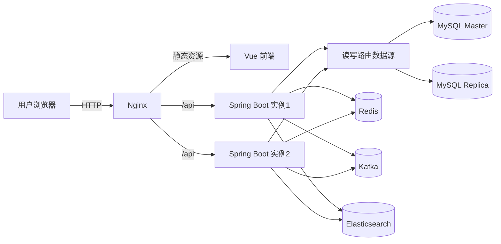

# 商品库存与秒杀系统（Vue 3 + Spring Boot 3）

本项目是一个“多实例部署 + 反向代理 + 缓存 + 消息队列 + 主从读写分离 + 搜索 + 订单分片”的秒杀演示系统。

## 一、当前实现概览

### 1.1 总体架构



### 1.2 关键能力

- 缓存三问题防护：穿透、击穿、雪崩
- MySQL 主从读写分离：`readOnly` 事务走从库，写事务走主库
- Kafka 异步下单：削峰填谷
- 雪花算法订单ID
- 秒杀幂等：同用户同商品去重
- 订单分片（选做已实现）：按用户ID路由分片组，按订单ID路由分片表
- Elasticsearch 商品搜索（支持降级回 MySQL LIKE）

### 1.3 服务与目录

- 后端：`backend-springboot`
- 前端：`frontend-vue`
- Nginx 配置与前端镜像构建：`web`
- 数据库脚本：`db`
- 容器编排：`docker-compose.yml`

## 二、技术栈

- 前端：Vue 3 + Vite
- 后端：Spring Boot 3.3 + MyBatis
- 数据库：MySQL 8.0（Master/Replica）
- 缓存：Redis 7
- 消息队列：Kafka 3.8
- 搜索：Elasticsearch 8.14
- 网关：Nginx
- 编排：Docker Compose

## 三、快速启动

### 3.1 环境要求

- Docker Desktop（或 Docker Engine）
- Docker Compose

### 3.2 一键启动

在项目根目录执行：

```bash
docker compose up -d --build
```

访问地址：

- 前端：`http://localhost:8080/`
- 健康检查：`http://localhost:8080/api/health`
- ES：`http://localhost:9200`
- Kafka：`localhost:9092`

### 3.3 常用重置命令

```bash
docker compose down -v
docker compose up -d --build
```

## 四、接口清单

| 模块 | 方法 | 路径 | 说明 |
| --- | --- | --- | --- |
| 健康 | GET | `/api/health` | 返回实例状态 |
| 用户 | POST | `/api/users/register` | 注册 |
| 用户 | POST | `/api/users/login` | 登录 |
| 商品 | GET | `/api/products` | 商品列表 |
| 商品 | GET | `/api/products/{id}` | 商品详情（带缓存） |
| 商品搜索 | GET | `/api/products/search?q=xxx` | ES 搜索，失败降级 MySQL |
| 秒杀 | POST | `/api/seckill` | 异步受理，返回 QUEUED |
| 订单 | GET | `/api/orders?userId=1` | 按用户查询订单 |
| 订单 | GET | `/api/orders/{orderId}` | 按订单ID查询订单/队列状态 |

## 五、功能验证步骤

### 5.1 健康检查

```bash
curl http://localhost:8080/api/health
```

### 5.2 登录

```bash
curl -X POST http://localhost:8080/api/users/login \
  -H "Content-Type: application/json" \
  -d "{\"username\":\"demo\",\"password\":\"pass123\"}"
```

### 5.3 秒杀下单（异步）

```bash
curl -X POST http://localhost:8080/api/seckill \
  -H "Content-Type: application/json" \
  -d "{\"userId\":1,\"productId\":1}"
```

返回示例：

```json
{"orderId":297212456596410368,"status":"QUEUED"}
```

### 5.4 按订单ID查询状态

```bash
curl http://localhost:8080/api/orders/297212456596410368
```

### 5.5 按用户ID查询订单

```bash
curl "http://localhost:8080/api/orders?userId=1"
```

### 5.6 搜索接口

```bash
curl "http://localhost:8080/api/products/search?q=手机"
```

## 六、设计要点

### 6.1 秒杀链路（当前实现）

1. 请求进入后先做 Redis 幂等判定  
2. Redis 预扣库存（快速失败）  
3. 生成雪花订单ID，写入 Kafka 消息  
4. 消费者落库订单并做数据库库存扣减  
5. 失败补偿：回滚 Redis 预扣与幂等键  

### 6.2 缓存策略

- 商品详情缓存 Key：`product:detail:{id}`
- 空值缓存 Key 同上，值为 `NULL`
- 击穿防护：互斥锁 `lock:product:detail:{id}`
- 雪崩防护：TTL 随机抖动

### 6.3 读写分离策略

- `@Transactional(readOnly = true)`：走从库
- 非只读事务：走主库
- 默认路由：写库

### 6.4 订单分片策略（选做）

- 分片表：`orders_u0_0`、`orders_u0_1`、`orders_u1_0`、`orders_u1_1`
- 用户维度：`userId % 2` 选择 `u0/u1`
- 表维度：`orderId % 2` 选择 `_0/_1`

## 七、数据库初始化

启动 MySQL 主库时自动执行：

- [schema.sql](file:///f:/distributed%20system/Distributed-System/db/schema.sql)
- [init-master.sql](file:///f:/distributed%20system/Distributed-System/db/mysql/init-master.sql)

从库初始化脚本：

- [init-replica.sh](file:///f:/distributed%20system/Distributed-System/db/mysql/init-replica.sh)

默认演示用户：

- 用户名：`demo`
- 密码：`pass123`

## 八、代码入口

- 启动入口： [SeckillApplication.java](file:///f:/distributed%20system/Distributed-System/backend-springboot/src/main/java/com/distributed/seckill/SeckillApplication.java)
- 编排配置： [docker-compose.yml](file:///f:/distributed%20system/Distributed-System/docker-compose.yml)
- 网关配置： [nginx.conf](file:///f:/distributed%20system/Distributed-System/web/nginx.conf)
- 秒杀服务： [SeckillService.java](file:///f:/distributed%20system/Distributed-System/backend-springboot/src/main/java/com/distributed/seckill/service/SeckillService.java)
- 消费者： [SeckillOrderConsumer.java](file:///f:/distributed%20system/Distributed-System/backend-springboot/src/main/java/com/distributed/seckill/service/SeckillOrderConsumer.java)

## 九、常见问题

### 9.1 镜像拉取慢/超时

- 已在 compose 中使用可用镜像源：
  - Elasticsearch：`docker.1ms.run/library/elasticsearch:8.14.3`
  - Kafka：`apache/kafka:3.8.0`

### 9.2 `502 Bad Gateway`

- 通常是后端未就绪
- 已配置 ES 健康检查并让后端等待 `service_healthy`
- 可执行：

```bash
docker compose ps
docker compose logs backend1 --tail=200
```

### 9.3 orphan 容器提示

可清理旧服务容器：

```bash
docker compose down --remove-orphans
```
