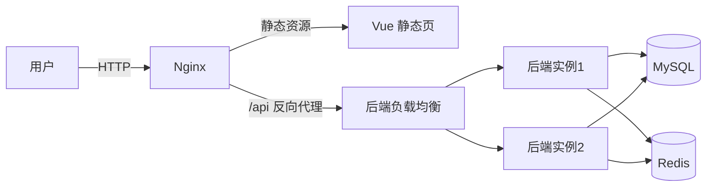
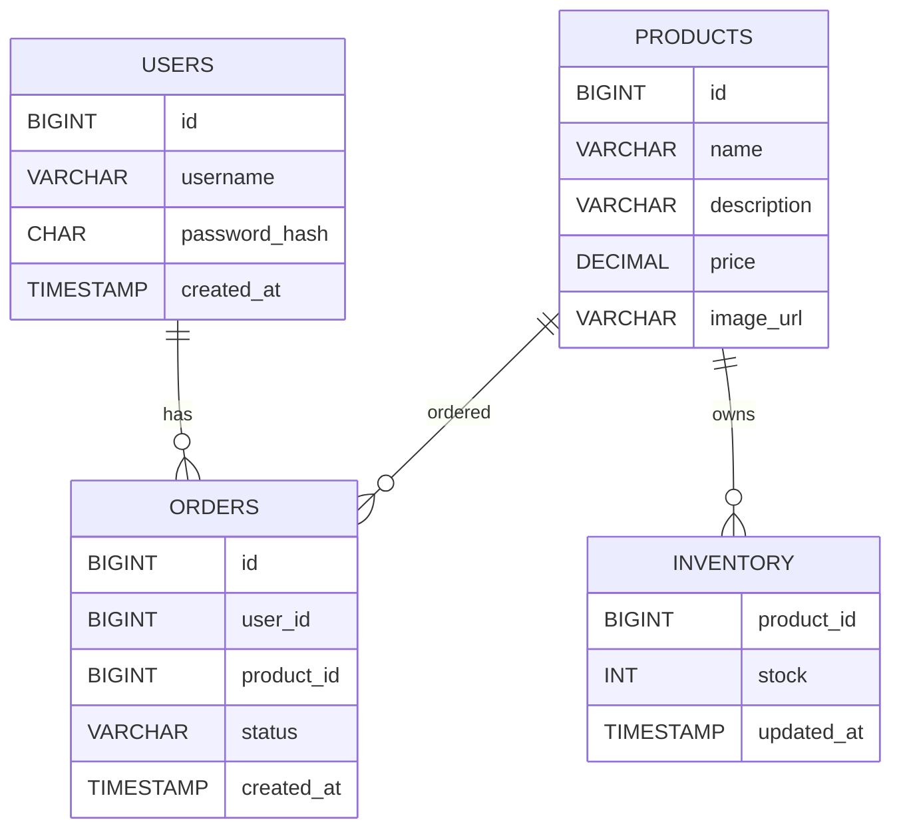

# 商品库存与秒杀系统设计与实现（Vue + Spring Boot）

## 一、系统设计文档

### 1.1 架构图



### 1.2 服务拆分与职责

- 用户服务：注册、登录、用户信息
- 商品服务：商品列表、商品详情（含图片）
- 库存服务：库存查询与扣减
- 订单服务：秒杀下单、订单查询

此仓库用单体应用实现以上逻辑职责，运行时通过多实例+Nginx 达到分布式部署效果。

### 1.3 API 接口（RESTful）

| 模块 | 方法 | 路径 | 说明 |
| --- | --- | --- | --- |
| 用户 | POST | /api/users/register | 注册 |
| 用户 | POST | /api/users/login | 登录 |
| 商品 | GET | /api/products | 商品列表（含图片） |
| 商品 | GET | /api/products/{id} | 商品详情（带库存与图片） |
| 订单 | GET | /api/orders?userId= | 查询订单 |
| 秒杀 | POST | /api/seckill | 秒杀下单 |
| 监控 | GET | /api/health | 实例健康检查 |

### 1.4 数据库 ER 图



### 1.5 技术选型说明

- 前端：Vue 3 + Vite
- 后端：Spring Boot 3 + MyBatis
- 数据库：MySQL 8.0
- 缓存：Redis 7
- 反向代理：Nginx
- 容器编排：Docker Compose

## 二、环境准备

### 2.1 依赖

- Docker Desktop 或 Docker Engine
- Docker Compose

### 2.2 目录结构

- backend-springboot：后端代码与 Dockerfile
- db：数据库初始化脚本
- frontend-vue：Vue 前端与 Vite 配置
- web：Nginx 配置与前端镜像构建
- docker-compose.yml：容器编排

## 三、详细操作文档

### 3.1 启动项目

在项目根目录执行：

```bash
docker compose up -d --build
```

如本机 3306 端口被占用，可使用默认映射的 3307：

- 本机端口：3307
- 容器端口：3306

启动成功后访问：

- 前端页面：http://localhost:8080
- 后端接口：http://localhost:8080/api/health

### 3.2 数据初始化

MySQL 容器启动时会自动执行 [schema.sql](file:///f:/distributed%20system/Distributed-System/db/schema.sql)，包含：

- 建库建表
- 示例用户与商品数据

默认用户：

- 用户名：demo
- 密码：pass123

### 3.3 功能验证

商品列表：

```bash
curl http://localhost:8080/api/products
```

商品详情（带缓存）：

```bash
curl http://localhost:8080/api/products/1
```

登录：

```bash
curl -X POST http://localhost:8080/api/users/login \
  -H "Content-Type: application/json" \
  -d "{\"username\":\"demo\",\"password\":\"pass123\"}"
```

秒杀下单：

```bash
curl -X POST http://localhost:8080/api/seckill \
  -H "Content-Type: application/json" \
  -d "{\"userId\":1,\"productId\":1}"
```

订单查询：

```bash
curl "http://localhost:8080/api/orders?userId=1"
```

### 3.4 负载均衡验证

连续请求多次商品列表接口，观察响应头中的 X-Instance 是否在 backend-1 与 backend-2 间切换：
后端实例分别监听 8081 与 8082，通过 Nginx 轮询转发。

```bash
curl -i http://localhost:8080/api/products
```

### 3.5 动静分离说明

- 静态资源由 Nginx 直接提供（/）
- 动态接口统一走 /api 并反向代理到后端实例

### 3.6 Redis 缓存说明

- 商品详情缓存 Key：product:detail:{id}
- TTL：60 秒
- 空对象缓存 15 秒，用于防止缓存穿透
- 秒杀成功后会删除对应商品缓存

### 3.7 JMeter 压测步骤

1. 新建测试计划
2. 线程组设置：
   - 线程数：100
   - Ramp-Up：10
   - 循环次数：10
3. 添加 HTTP 请求：
   - GET http://localhost:8080/api/products
   - POST http://localhost:8080/api/seckill
   - GET http://localhost:8080/ (静态资源)
4. 查看聚合报告与响应时间
5. 观察后端日志与 X-Instance，确认请求在多实例之间分配

## 四、实现要点

### 4.1 秒杀扣减流程

1. 事务开启
2. 执行库存扣减 SQL（带 stock > 0 条件）
3. 库存成功后创建订单
4. 提交事务并清理缓存

### 4.2 并发安全

- 通过数据库原子更新保证库存不超卖
- Redis 仅用于读缓存，不影响库存一致性

## 五、代码入口

- 后端入口：[SeckillApplication.java](file:///f:/distributed%20system/Distributed-System/backend-springboot/src/main/java/com/distributed/seckill/SeckillApplication.java)
- Nginx 配置：[nginx.conf](file:///f:/distributed%20system/Distributed-System/web/nginx.conf)
- Compose 配置：[docker-compose.yml](file:///f:/distributed%20system/Distributed-System/docker-compose.yml)

## 六、文件说明

详见 [FILE_GUIDE.md](file:///f:/distributed%20system/Distributed-System/FILE_GUIDE.md)

## 七、系统设计文档

详见 [SYSTEM_DESIGN.md](file:///f:/distributed%20system/Distributed-System/SYSTEM_DESIGN.md)
